# Software Architecture Document (SAD)
## Sipariş Teslim Süresi Tahmin Sistemi — MVP

| Alan | Değer |
|---|---|
| Doküman Türü | Software Architecture Document (SAD) |
| Sürüm | 1.1 — AI Prediction Katmanı Entegre Teknik Mimari Taban Çizgisi |
| Kapsam | 10 Günlük MVP (roadmap yeniden planlanacaktır) |
| Hedef ERP | Uyumsoft (Faz-2 gerçek entegrasyon) |
| Ekip | 4 Yazılım Geliştirici + 2 ERP Uzmanı |
| Durum | Teknik Mimari Onaylandı — Yeni Roadmap ve Görev Dağılımı Bekleniyor |

> Bu doküman, önceki aşamalarda alınmış tüm mimari kararların birleştirilmiş referansıdır. **Sürüm 1.1**, sisteme ikinci bir tahmin sağlayıcısı olarak gerçek fakat sınırlı bir **AI Prediction katmanı** ekleyen revizyonları ve son tutarlılık düzeltmelerini içerir. Mevcut mimari (Modular Monolith, Clean Architecture, `IErpDataProvider`, PredictionContext snapshot, Rule-Based Prediction + CPM, Step-Based Pipeline) korunmuştur; AI, mevcut motorun yanına eklenmiştir, içine gömülmemiştir.
>
> **Lead Time Birimi (kesin karar):** İç hesaplama ve kalıcılık temel birimi **working minutes (çalışma dakikası)**'dır. Rule-Based, AI ve Final Hybrid tahminleri aynı temel birimi kullanır. AI modelinin hedef değişkeni `actual_total_working_lead_time_minutes`'tir. AI takvim günü veya teslim tarihi tahmin etmez; teslim tarihi ve kullanıcıya gösterilen çalışma günü karşılığı her zaman C# `WorkingCalendar` servisi tarafından üretilir.

---

## İçindekiler

1. Giriş
2. Problem
3. Amaç
4. MVP
5. Fazlar
6. Teknolojiler
7. Genel Mimari
8. Katmanlar
9. Prediction Engine
10. CPM
11. Step Pipeline
12. ERP Integration
13. Security
14. Docker
15. Database
16. API
17. Frontend
18. Roadmap
19. Riskler
20. Faz-2

---

## 1. Giriş

### 1.1 Amaç ve Kapsam

Bu doküman, müşteri siparişlerinin **üretilip teslim edilme süresini tahmin eden** yazılımın 10 günlük MVP sürümünün yazılım mimarisini tanımlar. Doküman; mimari kararları, bileşenleri, veri modelini, entegrasyon yaklaşımını, güvenlik tabanını ve teslimat planını tek bir referansta toplar.

Sistem, nihai olarak **Uyumsoft ERP** ile entegre çalışacaktır. Ancak MVP süresince gerçek ERP erişimi bulunmayacağı varsayılır; ERP verisi, veri kaynağından bağımsız bir soyutlama (`IErpDataProvider`) üzerinden **mock bir kaynaktan** okunur.

### 1.2 Hedef Kitle

Bu doküman; yazılım geliştiriciler, ERP süreç uzmanları, teknik lider ve proje yöneticisi tarafından kullanılmak üzere hazırlanmıştır.

### 1.3 Yönlendirici İlkeler

- **Önce çalışan, basit ve sürdürülebilir çözüm.** Ölçeklenebilirlik ikinci planda tutulur.
- **Her karar gerekçelidir.** Gereksiz teknoloji veya tasarım kalıbı önerilmez.
- **Her özellik "MVP" veya "Faz-2" olarak sınıflandırılır.**
- **Tek komutla ayağa kalkan, canlı demoya uygun sistem** (Docker Compose).
- **Veri kaynağından bağımsızlık.** Gerçek entegrasyona geçildiğinde iş kuralları ve tahmin motoru yeniden yazılmaz.

### 1.4 Terimler

| Terim | Açıklama |
|---|---|
| MVP | Minimum Viable Product — 10 günde teslim edilecek çalışan sürüm |
| ERP | Kurumsal Kaynak Planlama sistemi (hedef: Uyumsoft) |
| BOM | Bill of Materials — ürün reçetesi |
| CPM | Critical Path Method — kritik yol yöntemi |
| DAG | Directed Acyclic Graph — yönlü çevrimsiz grafik |
| PredictionContext | Tahmin hesabının girdi/ara/çıktı durumunu taşıyan nesne |
| What-if | ERP'ye yazmayan simülasyon sipariş girişi |
| Read-only | Salt okunur; ERP ana verisi bizim tarafımızdan değiştirilmez |

---

## 2. Problem

Üretim yapan işletmelerde bir müşteri siparişinin ne zaman üretileceği ve teslim edileceği; stok durumu, ham madde tedarik süreleri, üretim hattı yoğunluğu, makine ve personel kapasitesi, öncelikli siparişler, ürün reçetesi/operasyon sayısı, planlı duruşlar, resmî tatiller ve sevkiyat süresi gibi çok sayıda faktöre bağlıdır.

Bu faktörler ERP içinde dağınık biçimde tutulur ve manuel değerlendirme;

- tutarsız teslim tarihi taahhütlerine,
- görünmeyen gecikme risklerine,
- planlama ekibinin sezgiye dayalı, açıklanamayan kararlarına

yol açar.

**Çözülmesi gereken problem:** ERP verilerini kullanarak bir sipariş için üretim başlangıç/bitiş, sevkiyat ve teslim tarihlerini **açıklanabilir** biçimde tahmin eden; gecikme riskini ve bu riski etkileyen faktörleri kullanıcıya gösteren bir karar destek sistemi geliştirmek.

---

## 3. Amaç

### 3.1 İş Amacı

Sistem, ERP verilerini kullanarak bir müşteri siparişi için aşağıdakileri hesaplar ve anlaşılır biçimde sunar:

- Üretime alınma (başlangıç) tarihi
- Üretimin tamamlanma (bitiş) tarihi
- Sevkiyata hazır olma tarihi
- Müşteriye tahmini teslim tarihi
- Siparişin gecikme ihtimali (risk seviyesi)
- Tahmini etkileyen temel faktörler (açıklanabilirlik)

### 3.2 MVP Başarı Kriterleri

MVP, aşağıdaki koşullar sağlandığında tamamlanmış kabul edilir:

1. Mock ERP veri kaynağından sipariş ve ilişkili ERP verileri **okunabilir**.
2. Bir sipariş için **kural tabanlı + basitleştirilmiş CPM** ile tahmin üretilebilir.
3. Tahmini üretim başlangıç/bitiş, sevkiyat ve teslim tarihleri **gösterilebilir**.
4. Gecikme durumu, kritik yol ve tahmini etkileyen faktörler **açıklanabilir**.
5. Tahmin sonucu uygulama veri tabanına **kaydedilebilir**.
6. **What-if** sipariş simülasyonu çalışır.
7. Sonuçlar **dashboard** üzerinde gösterilebilir.
8. Sistem **Docker Compose ile tek komutta** ayağa kalkar.
9. ERP veri sağlayıcısı değişirken **iş kuralları ve tahmin motoru değişmez**.

---

## 4. MVP

### 4.1 MVP Kapsamı (10 Gün)

MVP, başarı kriterlerini karşılamaya odaklıdır ve şu yetenekleri içerir:

1. **ERP Read Provider (Adapter):** Mock kaynaktan sipariş ve ilişkili ERP verilerinin salt okunur alınması.
2. **Kimlik ve Yetki:** JWT + rol bazlı erişim (Admin, Planner, Production Manager, Warehouse User, Sales User, ERP Integration User).
3. **Rule-Based Tahmin Sağlayıcısı (birincil):** Kural tabanlı + basitleştirilmiş CPM; Step-Based Pipeline; kritik yol, üretim başlangıç/bitiş, sevkiyat/teslim, gecikme riski, açıklayıcı faktörler.
4. **Baseline AI Tahmin Sağlayıcısı (ikincil):** Ayrı Python + FastAPI servisinde çalışan, tek gerçek fakat sınırlı baseline regresyon modeli (proof-of-concept).
5. **Hybrid Prediction Combiner:** Rule-Based ve AI sonuçlarını anomali kontrolü + ağırlıklı ortalama ile birleştirip Final Hybrid üretir; AI başarısızlığında RuleBasedFallback.
6. **Tahmin Kalıcılığı:** Final Hybrid + provider sonuçları + faktörlerin uygulama veri tabanına yazılması.
7. **What-if (Simülasyon) Sipariş:** ERP'ye yazmayan, tahmini tetikleyen sınırlı sipariş girişi (ürün, miktar, istenen teslim tarihi).
8. **Dashboard ve üç sonuçlu tahmin ekranı:** Aktif siparişler, gecikme riski, stok/kapasite bekleyenler; Rule-Based / AI / Final Hybrid kartları.
9. **Salt-okunur ERP görüntüleme ekranları:** Sipariş listesi/detay, stok, iş emri (CRUD yok).
10. **Güvenlik tabanı:** Input validation, global exception handling, hassas verinin loglanmaması, secret yönetimi, audit + integration log.
11. **Deployment:** Docker Compose ile tek komutta ayağa kalkan yapı.

Frontend MVP'si özet kartlar, durum rozetleri, tablolar ve basit metinsel/yatay aşama görünümüyle sınırlıdır; belirli bir grafik kütüphanesi MVP'nin zorunlu teknolojisi değildir (bkz. §17).

### 4.2 Kapsam Dışı (Bilinçli Erteleme)

Aşağıdakiler 10 gün için gerçekçi değildir ve bilinçli olarak Faz-2'ye taşınmıştır:

- Gelişmiş AI/ML ve MLOps: hyperparameter tuning, çoklu model karşılaştırması, otomatik yeniden eğitim, model registry, drift detection.
- Gerçek Uyumsoft verisiyle model yeniden eğitimi.
- Gerçek Uyumsoft canlı entegrasyonu — MVP'de sadece adapter arayüzü hazırlanır.
- Sonlu kapasite / gerçek APS optimizasyonu, kaynak dengeleme, alternatif makine seçimi, global çizelgeleme.
- Zamanlanmış otomatik senkron (Hangfire / Quartz).
- Gerçek zamanlı push (SignalR).
- Tahmin doğruluk takibi ve geri besleme döngüsü.
- Bildirim/uyarı, gelişmiş BI, karmaşık Gantt / interaktif timeline, bulut/HA/DR, çok kiracılı yapı.

> **ERP'ye veri yazma hakkında:** ERP ana verisi yönetimi bu uygulamanın temel sorumluluğu değildir. Gerçek Uyumsoft entegrasyonunda sistem varsayılan olarak salt okunur çalışır. Çift yönlü entegrasyon veya ERP'ye veri yazma, yalnızca açık bir iş gereksinimi ve güvenlik onayı oluşursa ayrıca değerlendirilir.

### 4.3 Kritik Kısıtlar (Bağlayıcı)

- ERP ana verisi (Müşteri, Ürün, BOM, Stok, Tedarikçi, Satın Alma, İş Emri, Üretim gerçekleşmeleri, Sevkiyat) **salt okunurdur**; bu veriler için CRUD ekranı ve tablo geliştirilmez.
- Uygulama veri tabanında yalnızca SAD §15'te tanımlanan uygulama tabloları tutulur. ERP ana verileri uygulama veri tabanına kopyalanmaz ve ERP kaynak verileri salt okunur olarak dış sağlayıcıdan alınır. **`PredictionProviderResults` tablosu, mevcut Rule-Based / AI / Final Hybrid yapısında zorunludur.**
- Tahminleme **iki bağımsız sağlayıcı** kullanır: birincil Rule-Based + CPM ve ikincil baseline AI regresyon modeli. Gelişmiş AI/ML ve MLOps Faz-2'dir.
- What-if girdisi için ayrı sipariş yönetimi tablosu oluşturulmaz; sınırlı özet `PredictionResults` içinde saklanır.

---

## 5. Fazlar

### 5.1 Faz Yaklaşımı

Proje iki fazda ele alınır. MVP (Faz-1) çalışan, demolanabilir ve genişletilebilir bir taban üretir. Faz-2, gerçek entegrasyon ve gelişmiş yetenekleri ekler. Mimari, Faz-2 geçişinde **iş kuralları ve tahmin motorunun yeniden yazılmamasını** garanti edecek biçimde tasarlanmıştır.

### 5.2 Modül Sınıflandırması

| Modül | Durum |
|---|---|
| Kimlik Doğrulama + Rol Bazlı Yetki | **MVP** |
| ERP Read Provider (Adapter + Mock) | **MVP** |
| Müşteri / Ürün+BOM / Stok (salt okunur) | **MVP** |
| Tedarikçi + Satın Alma (salt okunur) | **MVP** |
| İş Emri / Operasyon / İş Merkezi / Kapasite / Takvim (salt okunur) | **MVP** |
| Sevkiyat bilgisi (salt okunur) | **MVP** |
| What-if Simülasyon Sipariş | **MVP** |
| Rule-Based Tahmin Sağlayıcısı (Step Pipeline + CPM) | **MVP** |
| Baseline AI Prediction (tek baseline regresyon, FastAPI) | **MVP** |
| Hybrid Prediction Combiner | **MVP** |
| Tahmin Sonucu + Provider Sonuçları + Faktör Kalıcılığı | **MVP** |
| Dashboard ve üç sonuçlu tahmin ekranı | **MVP** |
| Audit Log / Integration Log | **MVP** |
| Docker Compose Deployment | **MVP** |
| Gelişmiş AI/ML ve MLOps (tuning, registry, drift, otomatik retraining) | Faz-2 |
| Gerçek Uyumsoft verisiyle model yeniden eğitimi | Faz-2 |
| Gerçek Uyumsoft Entegrasyonu | Faz-2 |
| ERP'ye yazma / çift yönlü entegrasyon (yalnızca iş+güvenlik onayıyla) | Faz-2 |
| Zamanlanmış Otomatik Senkron | Faz-2 |
| Gerçek Zamanlı Güncelleme (SignalR) | Faz-2 |
| Sonlu Kapasite / APS Optimizasyonu | Faz-2 |
| Tahmin Doğruluk Takibi + Geri Besleme | Faz-2 |
| Bildirim/Uyarı, Gelişmiş BI, Karmaşık Gantt, Bulut/HA/DR | Faz-2 |

---

## 6. Teknolojiler

Aşağıdaki yığın, ekip yetkinliği, 10 günlük süre ve "basit önce" ilkesi gözetilerek seçilmiştir. Her seçim gerekçelidir.

### 6.1 Backend

| Teknoloji | Karar | Gerekçe |
|---|---|---|
| .NET 8 (LTS) + ASP.NET Core Web API | **Kullanılacak** | Ekip .NET odaklı; LTS kararlılık ve uzun destek. |
| Entity Framework Core | **Kullanılacak** | Yalnızca uygulama DB'si için; dahili Unit of Work sağlar. |
| FluentValidation | **Kullanılacak** | Input validation kısıtını temiz karşılar, controller'ları şişirmez. |
| MediatR | **Kullanılmayacak** | 10 gün ve küçük ekip için gereksiz dolaylılık. Sade Application Service + isimlendirmeyle CQRS-lite. |
| AutoMapper | **Kullanılmayacak** | Çalışma zamanı mapping hatalarını gizler. Manuel mapping tercih edilir. |
| Hangfire / Quartz.NET | **Kullanılmayacak (Faz-2)** | Kalıcı job store MVP için fazla; on-demand tetikleme yeterli. |
| SignalR | **Kullanılmayacak (Faz-2)** | Dashboard MVP'de polling ile çalışır. |

### 6.2 Frontend

| Seçenek | Karar |
|---|---|
| **React + Vite + TypeScript** | **Seçildi.** Hızlı kurulum, olgun dashboard/grafik ekosistemi, ayrı frontend geliştiricisi mevcut. |
| Next.js | Gerekmez — dahili dashboard için SSR karmaşıklığı fazla. |
| Angular | 10 günde dik öğrenme eğrisi. |
| Blazor | Alternatif; MVP'de tercih edilmedi. |

UI kiti (tablo/form/grid hızlandırma) kullanılır. Grafik/görselleştirme MVP'de **zorunlu bir teknoloji değildir**; sonuçlar özet kartlar, durum rozetleri, tablolar ve basit metinsel/yatay aşama görünümüyle sunulur. Karmaşık Gantt ve interaktif timeline Faz-2'dir.

### 6.3 Veri Tabanı

**PostgreSQL** seçildi. Docker'da hafif ve lisanssız, EF Core desteği güçlü, tek komutlu demo için ideal. Uygulama DB'si ERP'den bağımsızdır; Uyumsoft'un altyapısı bu seçimi bağlamaz.

### 6.4 Tahminleme Teknolojisi

Sistem **iki bağımsız tahmin sağlayıcısı** kullanır ve sonuçları birleştirir.

**1) Rule-Based (birincil, değişmez):** Kural tabanlı + basitleştirilmiş CPM, tamamen .NET içinde (in-process). Motor saf, deterministik ve test edilebilir bir domain servisidir. Bu motor v1.0'dan **değişmeden** korunur.

**2) AI Prediction (ikincil, yeni):** Ayrı bir **Python + FastAPI** servisi olarak çalışan, gerçek fakat sınırlı bir **baseline regresyon modeli**. Ana .NET uygulamasına dış HTTP servisi olarak bağlanır; Domain katmanına Python/HTTP sızmaz.

> **v1.0 kararının güncellenmesi (çelişki notu):** SAD v1.0 §6.4, o aşamada yalnızca CPM bulunduğu için "ayrı Python servisi gereksizdir" demişti. AI Prediction katmanı **gerçek bir model** gerektirdiğinden, bu karar kapsam değişikliğiyle geçersiz kalmıştır. Ayrı Python/FastAPI servisi artık **bilinçli** bir karardır: .NET'te olgun bir gradient-boosting/regresyon eğitim ekosistemi bulunmadığından ve modelin gerçek ERP verisiyle yeniden eğitilebilir kalması gerektiğinden, model Python ekosisteminde tutulur. *(10 günlük MVP için uygun.)*

**AI baseline model (MVP):** Başlangıç adayı **HistGradientBoostingRegressor**'dır, ancak **kesin model değildir**. Nihai tek baseline model; veri setinin büyüklüğü, eksik değer oranı ve feature tipleri görüldükten sonra **Linear Regression, Random Forest Regressor veya HistGradientBoostingRegressor** arasından seçilir. MVP'de yalnızca **bir** model kullanılır; hyperparameter tuning ve çoklu model benchmark yapılmaz. **Mimari seçilen modele bağımlı değildir.** *(10 günlük MVP için uygun.)*

> **Kategorik feature işleme:** `product_ref` ve `product_category` gibi kategorik feature'lar modele doğrudan ham string olarak verilmez. Sürüm kontrollü preprocessing/encoding adımıyla model-ready sayısal temsile dönüştürülür. Preprocessing kurallarındaki kırıcı değişiklikler `feature_schema_version` yükseltilerek izlenir.

> **Lead time temel birimi (kesin karar):** İç hesaplama, karşılaştırma ve kalıcılık için temel birim **working minutes (çalışma dakikası)**'dır. Rule-Based, AI ve Final Hybrid aynı temel birimi (`working_lead_time_minutes`) kullanır. AI modelinin hedef değişkeni `actual_total_working_lead_time_minutes`'tir; AI doğrudan takvim günü veya teslim tarihi tahmin etmez. Teslim tarihi ve kullanıcıya gösterilen çalışma günü karşılığı, dakika değeri vardiya ve çalışma takvimi üzerine yerleştirilerek C# `WorkingCalendar` servisi tarafından üretilir.

> "MVP'de kullanılan AI modeli, mimari ve entegrasyon kabiliyetini doğrulayan gerçek bir baseline modeldir. Model sentetik veya açık veriyle eğitildiğinden Uyumsoft üretim verileri için doğrulanmış kabul edilmez. Gerçek geçmiş ERP verileri sağlandığında aynı feature sözleşmesi kullanılarak yeniden eğitilecek ve performansı ölçülecektir."

### 6.5 DevOps ve Altyapı

| Alan | Karar |
|---|---|
| Konteynerleştirme | Docker + Docker Compose (tek komutla ayağa kalkma). |
| CI | GitHub Actions (veya GitLab CI) — sadece build + test. |
| Reverse Proxy | Nginx (frontend statik servis + API proxy). |
| Secret/Config | `.env` + `.env.example`; connection string ve JWT secret environment variable ile. |
| Migration | EF Core Migrations; Compose ilk çalıştırmada otomatik uygulanır (demo kolaylığı). |
| Bulut | MVP'de gerekmez; demo lokal Docker'da. Bulut Faz-2. |

---

## 7. Genel Mimari

### 7.1 Ana Karar: Modular Monolith + Hafif Clean Architecture

**Ana .NET iş uygulaması Modular Monolith olarak tasarlanmıştır.** Domain, Application, Persistence, Integration, Infrastructure ve API katmanları aynı ana uygulama sınırı içindedir. **Frontend, PostgreSQL, Mock ERP API ve AI Prediction Service ayrı çalışma bileşenleridir.** Mock ERP ve AI servisi ana uygulamanın mikroservis modülleri değil, harici entegrasyon sınırlarının MVP karşılıklarıdır.

**Gerekçe:** Ana iş uygulamasını tek sınır içinde tutmak düşük operasyon yükü ve düşük ekip koordinasyon maliyeti sağlar. Mikroservis mimarisi **kesinlikle gerekli değildir**; dağıtık transaction, servis keşfi ve ağ hata yönetimi 10 günü tüketir ve hiçbir başarı kriterine katkı sağlamaz. Docker Compose, bu ana uygulamayı ve tüm harici çalışma bileşenlerini (frontend, postgres, mock-erp, ai-prediction) **tek komutla** birlikte ayağa kaldırır.

### 7.2 Sistem Bileşenleri

- **Web API (ASP.NET Core):** Auth, salt-okunur ERP sorguları, tahmin tetikleme/okuma, what-if simülasyonu, dashboard verileri.
- **Domain / Rule-Based Tahmin Motoru:** Kural tabanlı malzeme/kapasite kontrolü + CPM ile süre ve gecikme hesabı. **Değişmez.**
- **Prediction Orchestration (Application):** `PredictionOrchestrator`, iki sağlayıcıyı (`IPredictionProvider`) koordine eder; `IFinalPredictionCombiner` sonuçları birleştirir. **Yeni.**
- **AI Prediction Service:** Ayrı Python + FastAPI container'ı; feature preprocessing, model loading, prediction + health endpoint, kayıtlı model artifact. **Yeni.**
- **ERP Integration Katmanı:** `IErpDataProvider` + `MockErpDataProvider`; ayrıca AI için `IAiPredictionClient` + `FastApiPredictionClient` (HttpClient adapter). **Yeni AI istemcisi.**
- **Mock ERP API:** Ayrı, salt okunur, version-controlled JSON seed'den okuyan container.
- **Uygulama Veri Tabanı (PostgreSQL):** Users, Roles, UserRoles, PredictionResults, **PredictionProviderResults (yeni)**, PredictionFactors, AuditLogs, IntegrationLogs, SystemSettings.
- **Frontend (React SPA):** Login, dashboard, sipariş listesi/detay, **üç sonuçlu** tahmin ekranı (Rule-Based / AI / Final Hybrid), what-if formu, salt-okunur ERP görünümleri.
- **Reverse Proxy (Nginx):** Frontend + API tek origin.
- **CI Pipeline:** Build + test.
- **Docker Compose:** Beş container'ı tek komutla ayağa kaldıran orkestrasyon.

### 7.3 Bileşen İletişim Şeması

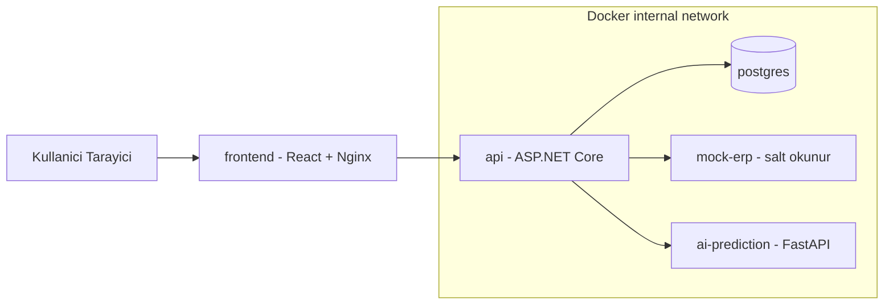

### 7.4 Üçlü Tahmin Akışı (AI Entegrasyonu)

Aynı `PredictionContext` snapshot'ı iki bağımsız sağlayıcıyı besler; sonuçlar güvenli biçimde birleştirilir. **Ana karar:** AI, mevcut motorun yanına ikinci bir `IPredictionProvider` olarak eklenir; içine gömülmez. Böylece Rule-Based motor değişmez, AI bağımsız evrilebilir ve AI çökse bile sistem Rule-Based ile çalışmaya devam eder. *(MVP için uygun.)*

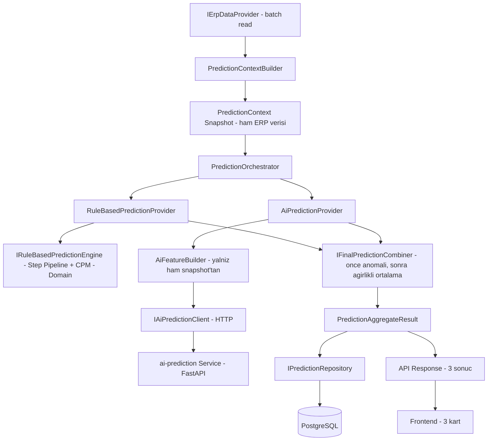

---

## 8. Katmanlar

### 8.1 Katman Sorumlulukları

| Katman | Sorumluluk |
|---|---|
| **Domain** | Saf iş mantığı: Entity, Value Object (`DateRange`, `Quantity`, `WorkingCalendar`), Prediction domain servisleri, CPM çekirdeği, `ICriticalPathCalculator`, `IClock`. **Dış bağımlılık yok.** |
| **Application** | Use-case orkestrasyonu, portlar (`IErpDataProvider`, `IPredictionRepository`, **`IAiPredictionClient`**), **`IPredictionProvider`** sözleşmesi ve iki implementasyonu (`RuleBasedPredictionProvider`, `AiPredictionProvider`), **`PredictionOrchestrator`**, **`AiFeatureBuilder`**, **`IFinalPredictionCombiner`**, **`PredictionAggregateResult`** DTO, ERP read DTO'ları, validasyon, Result Pattern. |
| **Integration** | `IErpDataProvider` impl: `MockErpDataProvider` (HttpClient → mock-erp); **`IAiPredictionClient` impl: `FastApiPredictionClient` (HttpClient → ai-prediction)**; DTO mapping. |
| **AI Prediction Service** | Ayrı Python + FastAPI prosesi: feature preprocessing, model loading, prediction + health endpoint, kayıtlı model artifact. **Ana .NET çözümünün dışındadır.** |
| **Persistence** | EF Core `DbContext`, entity konfigürasyonları, migrations, `IPredictionRepository` implementasyonu. |
| **Infrastructure** | JWT, `SystemClock` (IClock impl), loglama, global exception middleware, secret erişimi. |
| **API** | Controller'lar, authorization policy'leri, Swagger, global exception handling, Composition Root (DI). |
| **Frontend** | React SPA (ayrı container). |
| **Tests** | Domain birim testleri (özellikle CPM/kurallar), Application/API entegrasyon testleri, Integration testleri. |

### 8.2 Uygulanan Prensipler

- **Adapter / Provider Abstraction (`IErpDataProvider`)** — kısıtın kalbi; veri kaynağını değiştirilebilir kılar. **Zorunlu.**
- **SOLID + Dependency Injection** — .NET'te doğal, düşük maliyet.
- **Result Pattern** — öngörülebilir hata dönüşleri; exception'ları akış kontrolü için kullanmama.
- **Global Exception Handling (middleware)** — güvenli hata mesajları, tek noktadan loglama.
- **DTO / Entity / Value Object** — sınır netliği; ERP okuma modelleri (Read DTO) ile domain ayrımı.

### 8.3 Bilinçli Olarak Kullanılmayan Kalıplar

- **Generic Repository + ayrı Unit of Work:** EF Core zaten UoW; ERP tarafı Provider ile okunur. Eklenmez.
- **MediatR / tam CQRS + Event Sourcing:** Gereksiz dolaylılık. Faz-2.
- Yalnızca tahmin kalıcılığı için amaca özel, generic olmayan `IPredictionRepository` kullanılır (dar sözleşme, testi kolaylaştırır).

### 8.4 Bağımlılık Yönü (DI Akışı)

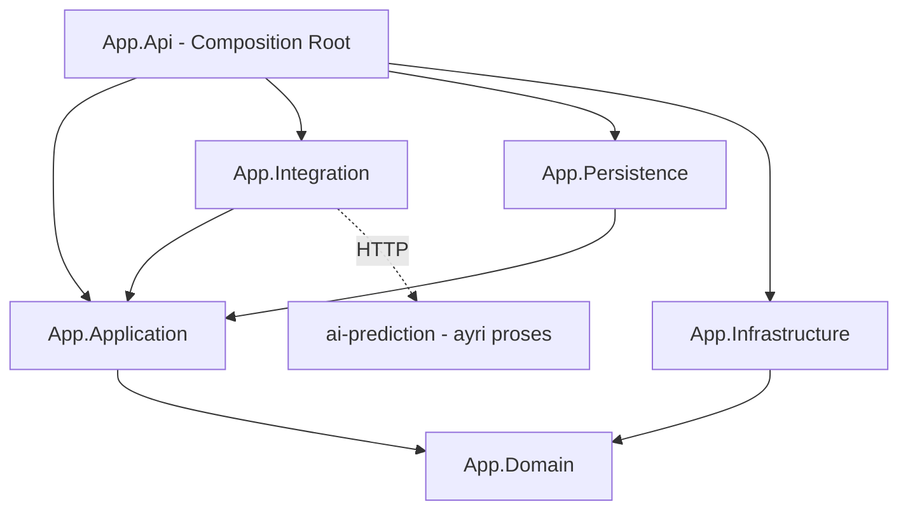

**Arayüz yerleşimi:**

| Arayüz | Tanımlandığı Katman | Implementasyon |
|---|---|---|
| `ICriticalPathCalculator` | Domain | Domain (saf) |
| `IClock` | Domain | Infrastructure (`SystemClock`) |
| `IRuleBasedPredictionEngine` | Domain | Domain (saf; Step Pipeline + CPM) |
| `IErpDataProvider` | Application | Integration (`MockErpDataProvider`) |
| `IAiPredictionClient` | Application | Integration (`FastApiPredictionClient`) |
| `IPredictionProvider` | Application | Application (`RuleBasedPredictionProvider`, `AiPredictionProvider`) |
| `IFinalPredictionCombiner` | Application | Application (weighted-average strateji) |
| `IPredictionRepository` | Application | Persistence |

**Kritik simetri:** `IAiPredictionClient` (Application port) → `FastApiPredictionClient` (Integration adapter) ikilisi, tıpkı `IErpDataProvider` → `MockErpDataProvider` gibidir. Gerçek entegrasyona geçişte yalnızca implementasyon değişir; Domain ve Application değişmez. **Domain, `async`/`HttpClient`/`CancellationToken`/`timeout`/JSON/FastAPI/Python bilmez** — AI yalnızca Application + Integration'da yaşar.

**Çalışma zamanı bağımlılığı içeri doğrudur:** `API → Application → Domain`. Somut sınıflar yalnızca `App.Api` startup'ında DI'a kaydedilir → Dependency Inversion sağlanır.

### 8.5 Proje Klasör Yapısı

```
solution-root/
├── src/
│   ├── App.Domain/          # Saf is mantigi: entity, VO, IRuleBasedPredictionEngine, Step Pipeline, CPM, IClock. Dis bagimlilik YOK.
│   ├── App.Application/      # Use-case; PredictionOrchestrator; IPredictionProvider (Rule/AI); AiFeatureBuilder;
│   │                         #   portlar (IErpDataProvider, IAiPredictionClient, IPredictionRepository); IFinalPredictionCombiner; DTO; Result.
│   ├── App.Integration/      # MockErpDataProvider (-> mock-erp) + FastApiPredictionClient (-> ai-prediction). HttpClient adapterlari.
│   ├── App.Persistence/      # EF Core DbContext, config, migrations, IPredictionRepository impl.
│   ├── App.Infrastructure/   # JWT, SystemClock, loglama, exception middleware, secret.
│   ├── App.Api/              # Web API: controller, auth policy, Swagger, Composition Root (DI).
│   └── MockErp.Api/          # Ayri salt-okunur Mock ERP API; JSON seed okur.
├── ai-prediction/            # Python + FastAPI servisi: egitim script'i, model artifact, prediction + health endpoint.
├── frontend/                 # React + Vite + TS SPA.
├── tests/
│   ├── App.Domain.Tests/     # CPM, kurallar, takvim/kapasite matematigi (en kritik alan).
│   ├── App.Application.Tests/ # Orchestrator, combiner, AiFeatureBuilder, fallback, port sozlesmesi.
│   └── App.Integration.Tests/ # MockErpDataProvider + FastApiPredictionClient entegrasyonu.
├── docker-compose.yml
├── .env.example
└── README.md
```

**Gerekçe:** Katman başına bir proje, referans yönünü **derleme zamanında zorunlu kılar** (ör. Domain, Persistence'a referans veremez). "Domain saf kalsın" kuralı dokümantasyonla değil derleyiciyle garanti edilir. Daha derin klasörlemeye MVP'de gerek yoktur.

---

## 9. Prediction Engine

### 9.1 Çekirdek Karar

ERP verisini **Application katmanı önceden çeker** ve `PredictionContext` içine "girdi anlık görüntüsü" (snapshot) olarak koyar. Böylece Domain'deki `PredictionEngine` ve kurallar **saf ve deterministik** kalır — hiçbiri `IErpDataProvider`'a, HTTP'ye veya Mock'a bağımlı değildir. Bu, hem "Domain dış bağımlılık içermemeli" kısıtını hem de "kurallar bağımsız test edilebilir olmalı" hedefini aynı anda karşılar.

> **v1.1 notu:** Bu bölümde tanımlanan Rule-Based motor **değişmemiştir**. Tek fark, motorun artık doğrudan değil, `RuleBasedPredictionProvider` (Application) arkasından çağrılmasıdır; provider saf `IRuleBasedPredictionEngine` domain sözleşmesini çalıştırır. Aşağıdaki 9.2–9.5 içeriği Rule-Based sağlayıcıyı anlatır; AI sağlayıcı, orkestrasyon, feature contract, birleştirme, fallback ve sonuç modeli 9.6–9.13'te eklenmiştir. Bölüm 9'daki tek sonuçlu (`PredictionResult`) ifadeler artık **Rule-Based sağlayıcının** sonucunu tanımlar; sistemin ürettiği nihai çıktı üç sonuçtur (Rule-Based / AI / Final Hybrid).

### 9.2 Uçtan Uca Akış

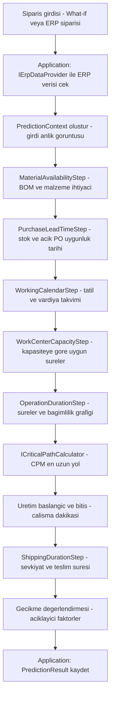

### 9.3 Sorumluluk Ayrımı

- `WorkingCalendarStep` ve `WorkCenterCapacityStep`, operasyonların **çalışılabilir/uygun sürelerini** hesaplar (tatil ve vardiya çıkarımı, kapasite kuyruğu; çalışma dakikası cinsinden).
- `OperationDurationStep` bu düzeltilmiş sürelerle **bağımlılık grafiğini** kurar.
- `ICriticalPathCalculator` yalnızca bu DAG üzerinde **en uzun yolu** bulur; takvim veya kapasite bilgisi taşımaz.

Böylece kapasite/takvim mantığı ile grafik matematiği birbirine karışmaz ve ayrı ayrı test edilebilir.

### 9.4 Domain Sınıf Yapısı

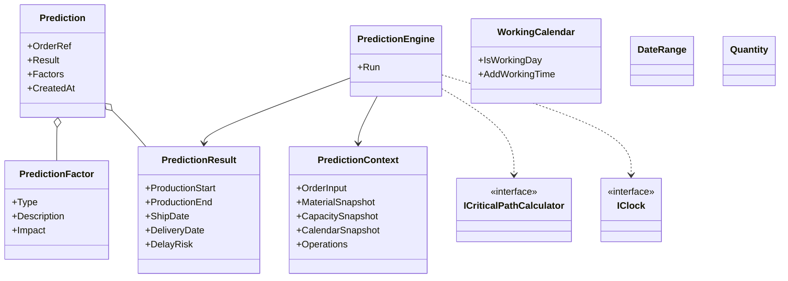

**Kararlar:**
- ERP verisi domain entity'sine dönüştürülmez; Integration/Application'da read-only DTO/read model olarak kalır, `PredictionContext`'e snapshot olarak enjekte edilir.
- Value Object'ler (`DateRange`, `Quantity`, `WorkingCalendar`) tarih/miktar/takvim aritmetiğini kapsüller.
- Domain'in hiçbir bağımlılığı yoktur; yalnızca domain'de tanımlı `IClock` ve `ICriticalPathCalculator` arayüzlerine dayanır.

### 9.5 Statü Modeli (Üç Ayrı Seviye)

v1.1'de birbirinden **tamamen farklı** anlamlara sahip üç statü kavramı vardır. Karışıklığı önlemek için karar tablosu:

| Statü | Seviye | Ne İfade Eder | Kim Üretir |
|---|---|---|---|
| `prediction_status` | Çalıştırma (genel) | Tahmin girdisinin işlenebilirliği: `Calculated`, `CalculatedWithAssumptions`, `InsufficientData`, `Infeasible` | Orchestrator (girdi/veri yeterliliğine göre) |
| `provider_status` | Sağlayıcı bazlı | Tek bir sağlayıcının (Rule-Based veya AI) sonucunun durumu: `Success`, `Timeout`, `ServiceUnavailable`, `InvalidResponse`, `InsufficientFeatures`, `ModelUnavailable`, `VersionMismatch`, `Rejected` | Her `IPredictionProvider` |
| `final_status` | Nihai birleşim | Hibrit sonucun nasıl üretildiği: `HybridCalculated`, `RuleBasedFallback`, `AiOnlyCandidate`, `InsufficientData`, `Infeasible` | `IFinalPredictionCombiner` |

Ek olarak `data_sufficiency_level` (`Full` / `Partial` / `Low`) verinin yeterliliğini ifade eder; **bir ML güven skoru değildir.**

**Bu üç statü birbirinin yerine kullanılamaz.** Örnek geçerli kombinasyon: `prediction_status = Calculated`, AI `provider_status = Timeout`, `final_status = RuleBasedFallback` — yani girdi işlenebilirdi, AI sağlayıcısı teknik olarak zaman aşımına uğradı, nihai sonuç Rule-Based'e düşerek üretildi.

### 9.6 AI Feature Bağımsızlığı ve AiFeatureBuilder Sınırı (Kesin Karar)

`AiFeatureBuilder`, Rule-Based Step Pipeline'ın **hiçbir ara veya nihai sonucuna bağımlı değildir.** AI feature'ları **yalnızca `PredictionContext` içindeki ham ERP snapshot verilerinden** üretilir. Örneğin `missing_material_count`, Rule-Based `MaterialAvailabilityStep` çıktısından değil; BOM × miktar ile eldeki stok karşılaştırılarak `AiFeatureBuilder` içinde **bağımsız** hesaplanır.

**`AiFeatureBuilder` yapabilir (yalnızca deterministik feature transformation):**
- BOM satırı sayabilir.
- Miktarları toplayabilir.
- Sayısal oran hesaplayabilir.
- Stok ile ihtiyaç arasındaki sayısal farkı çıkarabilir.
- Kategorik değerleri model-ready temsile (sürüm kontrollü encoding) dönüştürebilir.

**`AiFeatureBuilder` yapamaz (domain kararı üretmez):**
- Sipariş üretilebilir mi kararı veremez.
- Gecikme riski hesaplayamaz.
- Kritik yol belirleyemez.
- Tahmini teslim kararını veremez.
- Rule-Based Step Pipeline'ın ara veya nihai iş kararlarını kullanamaz.
- Rule-Based domain mantığını ikinci kez uygulayamaz.

**Gerekçe:** İki sağlayıcının gerçek anlamda bağımsız çalışması ve paralel yürütülebilmesi için AI'ın Rule-Based'in ara durumuna bağlı olmaması gerekir. `PredictionContextBuilder` mevcut haliyle **yeterlidir**; `PredictionFeaturePreparationService`, `EnrichedPredictionContext` veya ayrı bir FeaturePreparation katmanı **eklenmez** (gereksiz karmaşıklık). *(MVP için tercih edilen nihai mimari.)*

Akış: `PredictionContext` oluşturulur → `AiFeatureBuilder` feature üretir → AI HTTP çağrısı async başlar → aynı anda Rule-Based Step Pipeline + CPM çalışır → `IFinalPredictionCombiner` birleştirir.

### 9.7 Sağlayıcı Sınıf Diyagramı

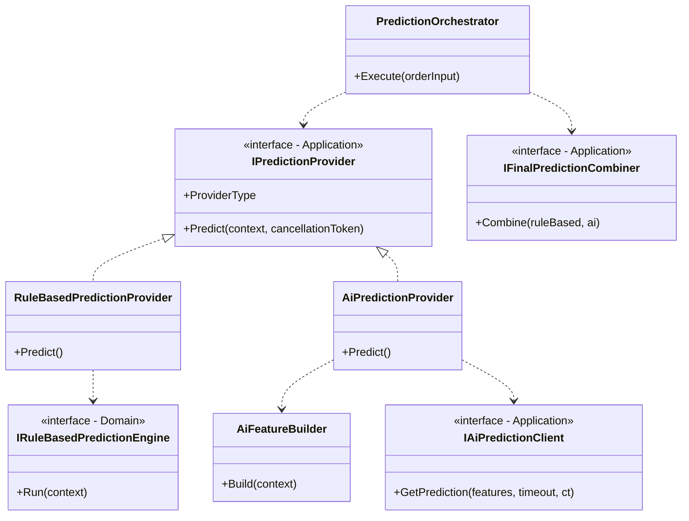

### 9.8 PredictionOrchestrator Akışı

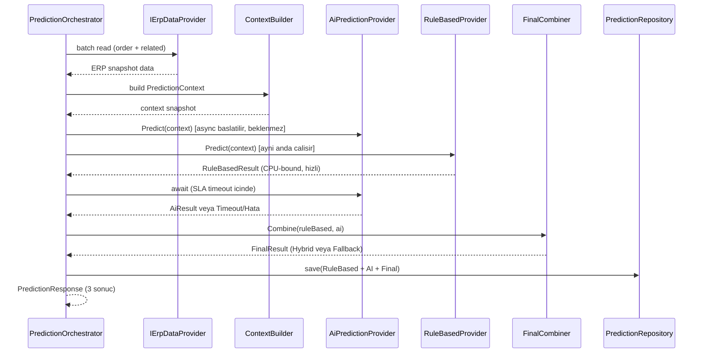

**Eşzamanlılık kararı:** AI HTTP çağrısı `await` edilmeden başlatılır; ağ beklerken CPU-bound Rule-Based hesaplama çalışır. Rule-Based **`Task.Run` içine alınmaz** (gereksiz thread-pool maliyeti). AI SLA içinde dönerse hibride girer; dönmezse `RuleBasedFallback` uygulanır. *(MVP için uygun.)*

### 9.9 AI Feature Contract

`AiFeatureBuilder` yalnızca model-ready alanlar üretir ve **yalnızca deterministik feature transformation yapar; domain kararı üretmez** (yapabilir/yapamaz sınırı için bkz. §9.6). **Hedef değişken: `actual_total_working_lead_time_minutes` (çalışma dakikası).** Model tarih/takvim günü/teslim tarihi tahmin etmez; teslim tarihi ve gösterilen çalışma günü karşılığı C# `WorkingCalendar` servisi tarafından üretilir.

| Feature | Ham Snapshot Kaynağı | Tip |
|---|---|---|
| product_ref / product_category | Ürün (sürüm kontrollü encoding ile) | kategorik |
| quantity | Sipariş | sayısal |
| bom_item_count | BOM | sayısal |
| missing_material_count | BOM × miktar vs stok (bağımsız hesap) | sayısal |
| total_missing_quantity | BOM × miktar vs stok (bağımsız hesap) | sayısal |
| maximum_supplier_lead_time_days | Açık PO / tedarik | sayısal |
| operation_count | Reçete operasyonları | sayısal |
| total_standard_operation_minutes | Operasyonlar | sayısal |
| work_center_load_ratio | Kapasite snapshot | sayısal |
| active_work_order_count | İş emri kuyruğu | sayısal |
| shift_capacity_minutes | Vardiya | sayısal |
| holiday_count | Takvim | sayısal |
| planned_downtime_minutes | Duruşlar | sayısal |
| shipping_duration_minutes | Sevkiyat | sayısal |
| requested_delivery_lead_minutes | Sipariş | sayısal |

> Kategorik alanlar (`product_ref`, `product_category`) modele ham string olarak verilmez; sürüm kontrollü preprocessing/encoding ile sayısal temsile dönüştürülür. Preprocessing'teki kırıcı değişiklikler `feature_schema_version` yükseltilerek izlenir.

**Sürüm alanları (baştan tutulur):** `feature_schema_version` (preprocessing/encoding değişikliklerini de temsil eder — ayrı `preprocessing_version` MVP'de eklenmez), `model_version`, `training_dataset_version`. *(MVP için uygun.)*

### 9.10 Feature Payload Kayıt ve İzlenebilirlik

AI servisine **gerçekten gönderilen** temizlenmiş feature vektörü, `feature_payload` (JSONB) olarak **yalnızca `PredictionProviderResults` tablosundaki AI satırında** saklanır. `PredictionResults` içine taşınmaz, API response'unda varsayılan olarak dönmez.

- `feature_schema_version`, `model_version`, `training_dataset_version` ile ilişkilendirilir.
- **İçermez:** müşteri adı, adres, kişisel veri, token, secret, modele gereksiz ERP alanları.
- Rule-Based için `feature_payload` zorunlu değildir; açıklanabilirliği kritik yol + `PredictionFactors` sağlar.
- **IntegrationLogs'ta payload tutulmaz.**

Amaç: hatalı AI tahmin debug'ı, sürüm karşılaştırması, tahmin↔gerçekleşme eşleştirmesi, retraining veri seti, yeniden üretilebilirlik. Saklama süresi, maskeleme, veri minimizasyonu ve arşivleme **Faz-2 operasyonel güvenlik** konusudur.

### 9.11 AI Servis SLA ve Timeout

| Ayar | Başlangıç | Kaynak |
|---|---|---|
| `AiPredictionTimeoutMs` | 3000 | env / SystemSettings (**koda gömülmez**) |

AI çağrısı async başlar → aynı pencerede Rule-Based çalışır → AI SLA içinde dönerse hibride girer → aşarsa **CancellationToken ile iptal** edilir → Rule-Based varsa anında `RuleBasedFallback`. Timeout isteğin tamamını başarısız yapmaz, `IntegrationLogs`'a yazılır, kullanıcıya AI sonucunun alınamadığı bildirilir. Retry MVP'de zorunlu değildir; uygulanırsa en fazla bir kısa retry ve toplam bekleme SLA'yı aşamaz. Health endpoint vardır ama başarılı health, prediction'ın timeout olmayacağını **garanti etmez**. *(MVP için uygun.)*

### 9.12 Hibrit Kombinasyon ve Anomali Kontrolü

`IFinalPredictionCombiner` bağımsız, değiştirilebilir stratejidir. **Anomali kontrolü, ağırlıklı ortalamadan ÖNCE** çalışır.

**Ağırlıklı ortalama (working minutes):**
`FinalWorkingLeadTimeMinutes = RuleBasedWorkingLeadTimeMinutes × 0.60 + AiWorkingLeadTimeMinutes × 0.40`
Ağırlıklar SystemSettings'te (`RuleBasedWeight`, `AiWeight`). Rule-Based'e yüksek ağırlık: motor deterministik/açıklanabilir; AI henüz Uyumsoft verisinde kanıtlanmamış. Ağırlık yönetim ekranı MVP'de yok.

**Anomali eşikleri (SystemSettings):** `AiVarianceThresholdPercent = 50` ve **mutlak fark eşiği dakika (veya yapılandırılabilir çalışma günü karşılığı) üzerinden** hesaplanır (ör. `AiVarianceThresholdWorkingMinutes`, başlangıçta ~2 çalışma günü karşılığı). **Yüzde ve mutlak eşik birlikte** aşılırsa AI hibritten çıkarılır → `RuleBasedFallback / AiPredictionOutsideTolerance`.

**AI sonucu doğrudan reddedilir:** negatif, sıfır, NaN, sonsuz, teknik üst sınır aşımı, geçersiz response, eksik zorunlu alan, model/feature_schema versiyon uyumsuzluğu.

Hibrit sonuç **çalışma dakikası** cinsinden hesaplanır. Teslim tarihi ve kullanıcıya gösterilen çalışma günü karşılığı, dakika değeri vardiya ve çalışma takvimi üzerine yerleştirilerek C# `WorkingCalendar` servisi tarafından üretilir; **basit sabit bölme kullanılmaz.** *(MVP için uygun.)*

### 9.13 Fallback ve Hata Yönetimi

| Rule-Based | AI | Sonuç → FallbackReason |
|---|---|---|
| ✅ | ✅ tolerans içinde | `HybridCalculated` |
| ✅ | ✅ tolerans dışında | `RuleBasedFallback` / `AiPredictionOutsideTolerance` |
| ✅ | Timeout | `RuleBasedFallback` / `AiPredictionTimeout` |
| ✅ | 5xx | `RuleBasedFallback` / `AiServiceUnavailable` |
| ✅ | Geçersiz response | `RuleBasedFallback` / `InvalidAiResponse` veya `InvalidAiValue` |
| ✅ | Feature yetersiz | `RuleBasedFallback` / `InsufficientAiFeatures` |
| ✅ | Model yüklenemedi | `RuleBasedFallback` / `AiModelUnavailable` |
| ✅ | Model/şema versiyon uyumsuz | `RuleBasedFallback` / `AiModelVersionMismatch` veya `AiFeatureSchemaMismatch` |
| ❌ (teknik hata) | ✅ | `AiOnlyCandidate` / `InsufficientData`; fallback_reason = `RuleBasedEngineError` (AI tek başına **üretim kararı olamaz**) |
| ❌ (geçersiz ERP verisi) | ✅ | `AiOnlyCandidate` / `InsufficientData`; fallback_reason = `InvalidErpData` |
| ❌ (BOM/operasyon döngüsü) | ✅ | `AiOnlyCandidate` / `InsufficientData`; fallback_reason = `OperationGraphCycleDetected` |
| ❌ | ❌ | `prediction_status` = `InsufficientData` / `Infeasible` |

**Davranış:** Rule-Based başarısız + AI başarılı olduğunda AI sonucu **tek başına nihai üretim kararı olarak kullanılmaz**; `final_status` = `AiOnlyCandidate` veya `InsufficientData` olur ve `fallback_reason` ilgili Rule-Based hata nedenini taşır. Her iki sağlayıcı başarısızsa `prediction_status` = `InsufficientData` veya `Infeasible` olur. **Teknik hata detayları kullanıcıya açılmaz**; kullanıcıya güvenli açıklama döner, ayrıntı `IntegrationLogs` veya uygulama loguna yazılır.

AI hataları `IntegrationLogs`'a yazılır (timeout, 5xx, feature validation, model yüklenememe, geçersiz response, versiyon uyumsuzlukları) — **hassas veri/payload olmadan.** Retry sınırlıdır.

### 9.14 Sonuç Modeli (Katman Türleri)

| Kavram | Katman Türü | Gerekçe |
|---|---|---|
| `PredictionContext` | Domain Model (snapshot girdisi) | Motor bunun üzerinde çalışır |
| `RuleBasedResult` (working_lead_time_minutes, critical_path, factors, status) | Domain Model çıktısı → Application DTO'ya map'lenir | Step Pipeline/CPM çıktısı domain'de üretilir |
| `AiResult` (working_lead_time_minutes, model_version, schema_version, dataset_version, status, warnings, payload ref) | Application DTO | AI dışsal servis çıktısı; domain'e girmez |
| `FinalResult` (final_working_lead_time_minutes, delivery_date, strategy, weights, final_status, fallback_reason, abs/rel diff, explanation) | Application DTO | Kombinasyon Application'da |
| `PredictionAggregateResult` (üçünü taşır) | Application DTO (use-case sonucu) | API + repository'ye taşınır |
| `DateRange`, `Quantity`, `WorkingLeadTime` (dakika tabanlı VO) | Value Object (Domain) | Değişmez, kendini doğrulayan tipler |
| Kalıcı satırlar | Persistence Entity | `PredictionResults` + `PredictionProviderResults` |

**Kural:** AI ve Final kavramları Domain'e sızmaz; Domain yalnızca Rule-Based sonucu üretir. *(MVP için uygun — kısıt gereği.)*

---

## 10. CPM

### 10.1 Algoritma Kapsamı

CPM **yalnızca DAG** üzerinde çalışır:

1. **Forward pass:** her operasyon için earliest start / earliest finish.
2. **Backward pass:** latest start / latest finish.
3. **Slack = 0** olan düğümler kritik yolu oluşturur; toplam süre kritik yolun uzunluğudur.

Bu, klasik ve deterministik bir algoritmadır.

### 10.2 Cycle Detection

`OperationGraph.HasCycle`, topolojik sıralama sırasında döngü tespit ederse `CriticalPathCalculator` **güvenli bir domain hatası** döner (exception ile akış kontrolü değil; Result/domain error ile). Böylece hatalı reçete verisi motoru kilitlemez.

### 10.3 Sınıf Diyagramı

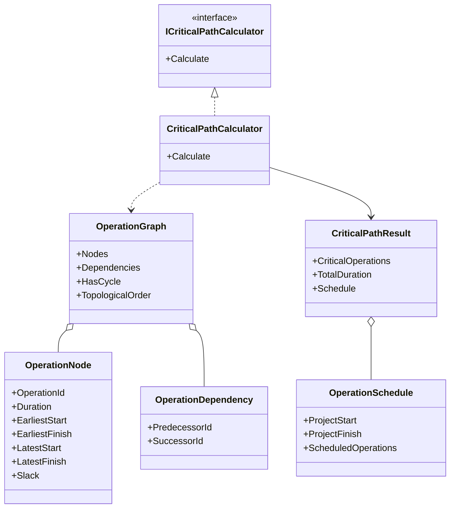

### 10.4 Kapsam Dışı (Faz-2)

APS optimizasyonu, kaynak dengeleme, alternatif makine seçimi, global çizelgeleme. CPM tek bir sipariş için en uzun bağımlılık zincirini bulur; kaynak rekabeti/optimizasyonu yapmaz.

---

## 11. Step Pipeline

> **Terminoloji (kesin ayrım):** "Rule-Based Prediction" **tahmin sağlayıcısının ve yaklaşımın** adıdır. "Step-Based Pipeline" bu Rule-Based motorun **iç teknik uygulamasıdır**. İç pipeline birimleri `IPredictionStep` sözleşmesini uygulayan `*Step` sınıflarıdır. API ve frontend tarafındaki `ruleBasedPrediction`, `RuleBasedPredictionDto`, `RuleBasedPredictionProvider`, `RuleBasedResult` adları **korunur**; bunlar iç Step adını değil, tahmin sağlayıcısı türünü ifade eder.

### 11.1 Yaklaşım

Genel amaçlı bir "Rule Engine" **kullanılmaz** (Rule DSL, Expression Engine, DB'den dinamik kural, Workflow Engine yok). Her adım, ortak bir sözleşmeyi (`IPredictionStep`) uygulayan, `PredictionContext`'i alıp zenginleştiren **açık bir sınıftır**. Rule-Based motor, adımları **sabit ve kod içinde belirlenmiş bir sırada** çağırır. Sıra bir listedir; dinamik değildir.

**Gerekçe:** Her adım bağımsız birim testine sahip olur. Dinamik motor, 10 günde test ve hata ayıklama maliyetini gereksiz artırırdı.

### 11.2 Step Sırası ve Context Girdi/Çıktıları

| # | Step | Okur | Yazar |
|---|---|---|---|
| 1 | **MaterialAvailabilityStep** | BOM, gerekli miktar, eldeki stok | Eksik malzeme + miktarlar |
| 2 | **PurchaseLeadTimeStep** | Eksik malzemeler, açık PO, tedarik süresi | Malzemenin en erken hazır zamanı |
| 3 | **WorkingCalendarStep** | Tatil takvimi, vardiyalar | Çalışma takvimi + en erken başlangıç zemini |
| 4 | **WorkCenterCapacityStep** | İş merkezi kuyruğu/kapasitesi, vardiya | Kapasiteye göre pencereler/etkin süreler (dakika) |
| 5 | **OperationDurationStep** | Reçete operasyonları, süreler, miktar, kapasite çıktısı | Süreli `OperationGraph` |
| — | *(CPM — step değil)* | OperationGraph | Kritik yol, üretim başlangıç/bitiş (dakika) |
| 6 | **ShippingDurationStep** | Üretim bitiş, sevkiyat süresi, lokasyon, takvim | Sevkiyat + teslim süresi |
| — | *(Engine finalizasyonu)* | Talep vs hesaplanan | DelayRisk + `PredictionFactor` listesi |

**Sıra gerekçesi:** Malzeme hazır tarihi bilinmeden üretim başlayamaz (1→2); üretim penceresi takvim cinsinden ifade edilmeli (3); kapasite bunun üzerine oturur (4); süreler ve grafik en son kurulur (5); sevkiyat ancak üretim bittikten sonra hesaplanır (6). Gecikme değerlendirmesi tüm tarihler netleştikten sonra yapılır.

---

## 12. ERP Integration

### 12.1 Soyutlama

`IErpDataProvider`, **Application katmanında** tanımlı bir "port"tur; döndürdüğü tipler Application'a ait **read model / DTO**'lardır. Domain ve kurallar bu arayüzü hiç görmez. Sağladığı salt-okunur veriler: sipariş, kalemler, ürün/BOM, stok, açık satın alma, iş emri, kapasite/takvim, sevkiyat süresi.

### 12.2 MockErpDataProvider

`MockErpDataProvider` bellekte veri tutmaz; `HttpClient` ile ayrı `mock-erp` container'ına salt-okunur HTTP çağrıları yapan bir **adapter**'dır. Gelen JSON'u Application read model'lerine map'ler.

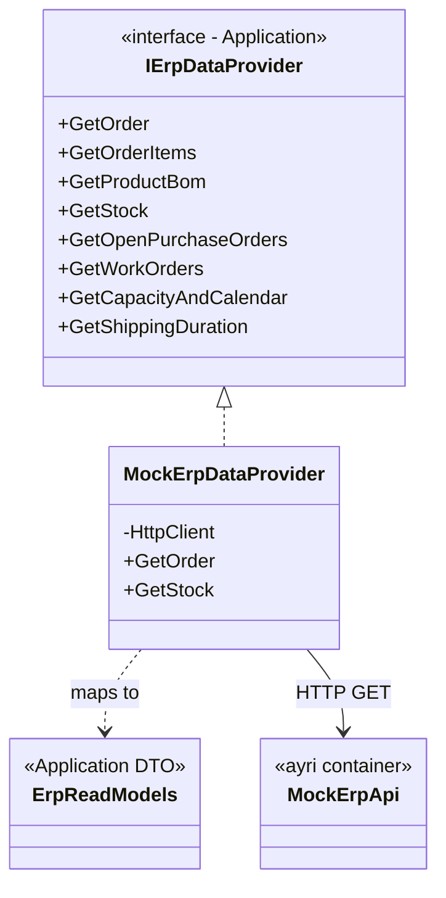

### 12.3 Faz-2 Uyumu

Mock'a özgü tipler Application/Domain'e sızmaz; `mock-erp`'in ham JSON şekilleri yalnızca Integration içinde kalır. Gerçek Uyumsoft entegrasyonunda **sadece bu sınıf** (`UyumsoftErpDataProvider`) değişir; motor, kurallar ve API'ye dokunulmaz.

### 12.4 Mock ERP API

- **Tamamen salt-okunur**; CRUD endpoint içermez.
- **Version-controlled JSON seed**'den okur; aynı seed → aynı çıktı (deterministik). Hem testleri hem demoyu tekrarlanabilir kılar.
- Demo senaryolarını destekler: stok yeterli, stok eksik, tedarik gecikmesi, kapasite doluluğu, tatil/bakım çakışması.
- **Ayrı container gerekçesi:** Gerçek entegrasyona en yakın topoloji; provider gerçek HTTP çağrısı yapar, Faz-2'de yalnızca base URL ve implementasyon değişir. Retry/timeout/mapping davranışı MVP'de gerçekçi biçimde test edilir.

### 12.5 Dayanıklılık

Provider çağrılarında **timeout ve retry** uygulanır; her çağrı `IntegrationLogs`'a yazılır (hassas veri hariç). Gerçek senkronizasyon yapılmadığından, MVP'de bir **health/check** yaklaşımı kullanılır (bkz. §16).

### 12.6 AI Prediction Client (Simetrik Adapter)

AI servisi, ERP provider'ıyla **aynı port/adapter desenini** izler: `IAiPredictionClient` (Application port) → `FastApiPredictionClient` (Integration adapter). İstemci, `AiFeatureBuilder`'ın ürettiği temizlenmiş feature vektörünü `ai-prediction` servisine `HttpClient` ile gönderir ve çalışma günü tahminini alır.

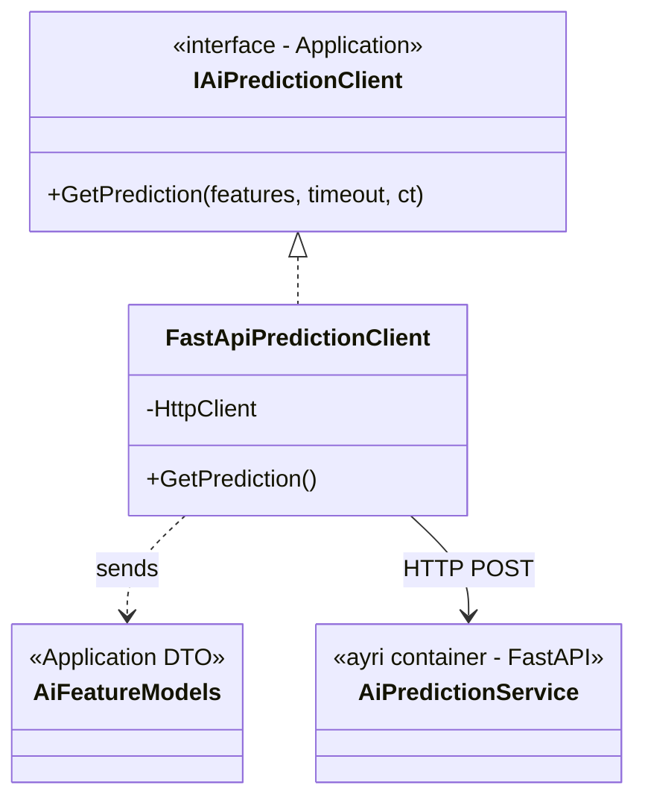

- AI servisine özgü response şekilleri yalnızca Integration'da kalır; Application'a `AiResult` DTO'su çıkar.
- Timeout `IAiPredictionClient` çağrısına parametre olarak geçer; koda gömülmez (env/SystemSettings).
- Faz-2'de gerçek model registry veya farklı bir AI altyapısına geçilse dahi yalnızca bu adapter değişir.

---

## 13. Security

### 13.1 Minimum Güvenlik Tabanı

- **JWT tabanlı kimlik doğrulama** (Refresh Token MVP dışıdır).
- **Rol bazlı yetkilendirme** (policy-based).
- **Input validation** (FluentValidation).
- **Global exception handling** — güvenli hata mesajları.
- **Hassas bilgilerin loglanmaması.**
- **Secret ve connection string yönetimi** (environment variable).
- **Audit log** (kritik işlemler, login denemeleri, rol/tarih değişiklikleri).
- **ERP verilerine salt okunur erişim.**

### 13.2 Roller

Admin, Planner, Production Manager, Warehouse User, Sales User, ERP Integration User.

### 13.3 API Güvenliği (OWASP-lite)

HTTPS, CORS, rate limiting, input validation, güvenli hata mesajları, API request size limitleri. Frontend yalnızca API ile konuşur; `postgres` ve `mock-erp` dışarıya expose edilmez (saldırı yüzeyi minimum).

### 13.4 Veri Güvenliği

Parola hash'leme, connection string ve secret'ların env üzerinden yönetimi, loglara kişisel veri yazılmaması, least-privilege veri tabanı erişimi.

### 13.5 AI Katmanı Güvenlik Kuralları

- **AI servis izolasyonu:** `ai-prediction` frontend veya PostgreSQL ile doğrudan konuşmaz; yalnızca `api` üzerinden erişilir, dışarıya expose edilmez.
- **Feature payload veri minimizasyonu:** `feature_payload` yalnızca modele gerekli sayısal/kategorik alanları içerir; müşteri adı, adres, kişisel veri, token, secret **tutulmaz**. Yalnızca `PredictionProviderResults`'taki AI satırında saklanır.
- **Log hijyeni:** AI hata/timeout kayıtları `IntegrationLogs`'a yazılır; bu kayıtlarda `feature_payload` veya hassas veri **bulunmaz.**
- **Timeout yönetimi:** AI SLA'sı env/SystemSettings'ten okunur, koda gömülmez.
- Feature payload saklama süresi, maskeleme ve arşivleme politikası **Faz-2 operasyonel güvenlik** konusudur.

---

## 14. Docker

### 14.1 Compose Mimarisi

**Beş servis:** `frontend`, `api`, `postgres`, `mock-erp`, **`ai-prediction`**.

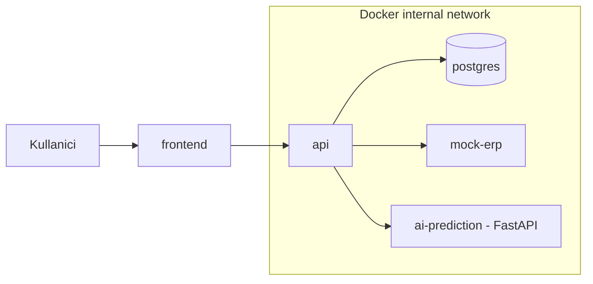

- **frontend** yalnızca **api** ile konuşur.
- **api** → `postgres`, `mock-erp`, `ai-prediction` (internal network).
- **ai-prediction** doğrudan **frontend** veya **postgres** ile konuşmaz; yalnızca kendi model artifact'ini ve uygulama dosyalarını kullanır.
- **postgres**, **mock-erp**, **ai-prediction** dışarıya **expose edilmez.**
- `ai-prediction` bir **health endpoint** sunar.
- Geliştirmede yalnızca `frontend` (ve gerekirse `api`/Swagger) host'a yayınlanır.

### 14.2 Model Artifact Yaklaşımı

MVP'de AI model artifact'i **container image içine gömülür** (build sırasında kopyalanır). **Gerekçe:** tek komutla tekrarlanabilir demo, ekstra volume/mount yönetimi yok, "aynı image → aynı model" determinizmi. Sık model güncellemesi gerektiren read-only volume yaklaşımı **Faz-2**'dir. *(MVP için uygun.)*

### 14.3 Migration ve Tek Komut

EF Core Migrations, `api` başlangıcında **otomatik** uygulanır. Sistem `docker compose up` ile **tek komutta** ayağa kalkar ve canlı demoya hazır olur. (Production'da kontrollü migration Faz-2'dir.)

---

## 15. Database

### 15.1 Kapsam

PostgreSQL yalnızca uygulama verisi için kullanılır. ERP verisi PostgreSQL'e zorunlu olarak yazılmaz; talep anında `mock-erp`'ten okunur.

**Tablolar:** Users, Roles, UserRoles, PredictionResults, **PredictionProviderResults (yeni)**, PredictionFactors, AuditLogs, IntegrationLogs, SystemSettings.

**v1.1 model kararı:** Rule-Based / AI / Final sonuçlarını ayrı izlemek için iki yaklaşım değerlendirildi — (A) `PredictionResults`'a onlarca alan eklemek, (B) bire-çok `PredictionProviderResults` tablosu. **Seçilen: B.** Neden: A, sütun patlaması ve seyrek (null) alanlar yaratır, yeni sağlayıcı eklemek şema değişikliği gerektirir; B, her sağlayıcıyı bir satır yapar, `feature_payload`'u yalnızca AI satırında tutar, genişlemeye açıktır. Böylece **`PredictionResults` yalnızca Final Hybrid sonucunu temsil eder**; provider bazlı sonuçlar `PredictionProviderResults`'ta durur. *(MVP için uygun; Faz-2'ye uyumlu.)*

### 15.2 EF Core Stratejisi

DbContext dahili Unit of Work olarak kullanılır; `SaveChanges` izlenen değişiklikleri tek transaction içinde işler. Ayrı Generic Repository + UoW katmanı yazılmaz. Tahmin kalıcılığı için amaca özel `IPredictionRepository` kullanılır (`PredictionResults` + provider satırları + faktörler tek `SaveChanges` ile yazılır).

### 15.3 Konvansiyonlar

- Primary key'ler: `bigint` identity (increment).
- ERP dış referansları: `varchar`.
- Tarih-saat alanları: `timestamptz` (UTC varsayımı).
- **Lead time alanları çalışma dakikası (working minutes) cinsindendir ve `bigint` saklanır** (`*_working_lead_time_minutes`). Gün gösterimi yalnızca UI seviyesinde, `WorkingCalendar` üzerinden türetilir.
- Enum'lar: `prediction_status`, `delay_risk`, `data_sufficiency_level`, **`provider_type`, `provider_status`, `final_status`, `fallback_reason` (yeni)**.
- `feature_schema_version` preprocessing değişikliklerini de temsil eder; ayrı `preprocessing_version` alanı MVP'de **eklenmez**.

### 15.4 DBML Şeması (dbdiagram.io / PostgreSQL)

```dbml
enum prediction_status {
  Calculated
  CalculatedWithAssumptions
  InsufficientData
  Infeasible
}

enum delay_risk {
  None
  Low
  Medium
  High
}

enum data_sufficiency_level {
  Full
  Partial
  Low
}

enum provider_type {
  RuleBased
  Ai
}

enum provider_status {
  Success
  Timeout
  ServiceUnavailable
  InvalidResponse
  InsufficientFeatures
  ModelUnavailable
  VersionMismatch
  Rejected
}

enum final_status {
  HybridCalculated
  RuleBasedFallback
  AiOnlyCandidate
  InsufficientData
  Infeasible
}

enum fallback_reason {
  None
  AiPredictionTimeout
  AiPredictionOutsideTolerance
  AiServiceUnavailable
  InvalidAiResponse
  InsufficientAiFeatures
  AiModelUnavailable
  AiModelVersionMismatch
  AiFeatureSchemaMismatch
  InvalidAiValue
  RuleBasedEngineError
  InvalidErpData
  OperationGraphCycleDetected
}

Table Users {
  id            bigint       [pk, increment]
  username      varchar(100) [not null, unique]
  email         varchar(200)
  password_hash varchar(255) [not null]
  is_active     boolean      [not null, default: true]
  created_at    timestamptz  [not null]
  updated_at    timestamptz
}

Table Roles {
  id          bigint      [pk, increment]
  name        varchar(50) [not null, unique]
  description varchar(250)
}

Table UserRoles {
  user_id bigint [not null, ref: > Users.id]
  role_id bigint [not null, ref: > Roles.id]
  indexes {
    (user_id, role_id) [pk]
    role_id
  }
}

// PredictionResults artik YALNIZCA Final Hybrid sonucunu temsil eder.
// Provider bazli (Rule-Based / AI) sonuclar PredictionProviderResults'ta tutulur.
Table PredictionResults {
  id                          bigint                 [pk, increment]
  erp_order_ref               varchar(100)
  is_simulation               boolean                [not null, default: false]
  simulation_input_summary    jsonb
  status                      prediction_status      [not null]
  data_sufficiency_level      data_sufficiency_level [not null, default: 'Full']
  // Final hibrit ozet — final_status default TASIMAZ, uygulama acikca atar
  final_status                final_status           [not null]
  fallback_reason             fallback_reason        [not null, default: 'None']
  combination_strategy        varchar(60)            // nullable; HybridCalculated->WeightedAverage, RuleBasedFallback->RuleBasedOnly
  rule_based_weight           numeric(4,2)
  ai_weight                   numeric(4,2)
  final_working_lead_time_minutes bigint
  absolute_difference_minutes bigint
  relative_difference_percent numeric(6,2)
  // Final hibrit tarihleri (C# WorkingCalendar ile hesaplanir)
  production_start            timestamptz
  production_end              timestamptz
  ship_date                   timestamptz
  delivery_date               timestamptz
  requested_delivery_date     timestamptz
  delay_risk                  delay_risk             [not null, default: 'None']
  critical_path_summary       jsonb
  calculated_at               timestamptz            [not null]
  created_by                  bigint                 [ref: > Users.id]
  indexes {
    erp_order_ref
    status
    final_status
    delay_risk
    calculated_at
  }
}

// Provider basina bir satir (RuleBased, Ai). feature_payload yalnizca Ai satirinda dolar.
Table PredictionProviderResults {
  id                       bigint          [pk, increment]
  prediction_result_id     bigint          [not null, ref: > PredictionResults.id]
  provider_type            provider_type   [not null]
  provider_status          provider_status [not null]
  working_lead_time_minutes bigint
  estimated_delivery_date  timestamptz
  // Yalnizca AI icin doldurulur (Rule-Based'te null)
  model_version            varchar(50)
  feature_schema_version   varchar(50)
  training_dataset_version varchar(50)
  feature_payload          jsonb
  warnings                 jsonb
  duration_ms              int
  created_at               timestamptz     [not null]
  indexes {
    (prediction_result_id, provider_type) [unique]
    provider_type
  }
}

Table PredictionFactors {
  id                   bigint       [pk, increment]
  prediction_result_id bigint       [not null, ref: > PredictionResults.id]
  factor_type          varchar(80)  [not null]
  description          varchar(500) [not null]
  impact               varchar(50)
  indexes {
    prediction_result_id
  }
}

Table AuditLogs {
  id         bigint       [pk, increment]
  user_id    bigint       [ref: > Users.id]
  action     varchar(100) [not null]
  entity     varchar(100)
  entity_ref varchar(100)
  ip_address varchar(64)
  details    jsonb
  created_at timestamptz  [not null]
  indexes {
    user_id
    created_at
  }
}

// ERP ve AI dis servis cagrilarini birlikte loglar. feature_payload/hassas veri YAZILMAZ.
Table IntegrationLogs {
  id                bigint       [pk, increment]
  integration_type  varchar(50)  [not null]   // ERP, AI
  operation         varchar(100) [not null]
  external_resource varchar(100)
  request_ref       varchar(100)
  is_success        boolean      [not null]
  status_code       int
  duration_ms       int
  message           varchar(1000)
  created_at        timestamptz  [not null]
  indexes {
    integration_type
    is_success
    created_at
    (integration_type, created_at)
  }
}

Table SystemSettings {
  id         bigint       [pk, increment]
  key        varchar(100) [not null, unique]
  value      varchar(500)
  updated_at timestamptz  [not null]
}
```

### 15.5 What-if Verisi

What-if girdisi ayrı ilişkisel tabloya açılmaz. `simulation_input_summary` (jsonb) yalnızca sınırlı özet tutar: ürün referansı, miktar, istenen teslim tarihi, öncelik ve gerekirse müşteri referansı. Ayrı `SimulationOrders` / `CustomerOrders` tablosu oluşturulmaz.

---

## 16. API

### 16.1 İlkeler

- Yalnızca MVP canlı demo akışı için gerekli minimum endpoint'ler. **Endpoint'ler v1.1'de değişmez; yalnızca response modeli genişler** (üçlü sonuç taşır).
- ERP ana verisi salt-okunurdur → yalnızca `GET`.
- `calculate` ve `simulate`: PredictionResult üretilebiliyorsa **her durumda `201`**; gerçek iş sonucu `status` + `data_sufficiency_level` + `finalStatus` alanlarında taşınır. AI timeout/hata isteği başarısız yapmaz (Rule-Based fallback ile `201` döner).
- `422` yalnızca iş akışı başlatılamadığında / zorunlu girdi eksikliğinde döner.
- `502` = upstream (mock-erp) hatası; `503` = health kontrolünde erişilemezlik.
- Gerçek senkronizasyon yapılmadığından `sync` yerine salt bağlantı kontrolü yapan `health` endpoint'i kullanılır (ERP ve AI için ayrı).
- Tüm lead time alanları **çalışma dakikası (working minutes)** cinsindendir; gün gösterimi yalnızca UI seviyesindedir. `feature_payload` response'ta varsayılan **dönmez** (yetkili debug/audit erişimi Faz-2).

### 16.2 Endpoint Tablosu

| Method | Endpoint | Yetkili Roller | Başarı | Hata |
|---|---|---|---|---|
| POST | `/api/auth/login` | Anonim | 200 | 400, 401 |
| GET | `/api/erp/orders` | Tümü (auth) | 200 | 401, 403, 502 |
| GET | `/api/erp/orders/{ref}` | Tümü (auth) | 200 | 401, 403, 404, 502 |
| POST | `/api/predictions/calculate` | Planner, ProductionManager, Admin | 201 | 400, 401, 403, 404, 422, 502 |
| POST | `/api/predictions/simulate` | Planner, Sales, Admin | 201 | 400, 401, 403, 422, 502 |
| GET | `/api/predictions` | Tümü (auth) | 200 | 401, 403 |
| GET | `/api/predictions/{id}` | Tümü (auth) | 200 | 401, 403, 404 |
| GET | `/api/predictions/delayed` | Planner, ProductionManager, Admin | 200 | 401, 403 |
| GET | `/api/dashboard/summary` | Tümü (auth) | 200 | 401, 403 |
| GET | `/api/integrations/erp/health` | Admin, ErpIntegrationUser | 200 | 401, 403, 503 |
| GET | `/api/integrations/ai/health` | Admin, ErpIntegrationUser | 200 | 401, 403, 503 |
| GET | `/api/integrations/logs` | Admin | 200 | 401, 403 |

### 16.3 Dokümantasyon

Swagger/OpenAPI tüm endpoint'leri kapsar; Postman collection dışa aktarılır.

### 16.4 Tahmin Response DTO Yapısı (Üçlü Sonuç)

`calculate`/`simulate` response gövdesi üç sonucu birlikte taşır. Yeni endpoint eklenmez. **Tüm sağlayıcılar aynı temel birimi (`workingLeadTimeMinutes`) kullanır.** Eski `workingLeadTimeDays` / `estimatedLeadTimeDays` alanları **kaldırılmıştır.**

| DTO | Temel Alanlar |
|---|---|
| **PredictionResponse** | predictionId, ruleBasedPrediction, aiPrediction, finalPrediction, status, dataSufficiencyLevel, calculatedAt |
| **RuleBasedPredictionDto** | workingLeadTimeMinutes, displayWorkingLeadTime, estimatedDeliveryDate, criticalPathSummary, factors, providerStatus |
| **AiPredictionDto** | workingLeadTimeMinutes, displayWorkingLeadTime, estimatedDeliveryDate, modelVersion, featureSchemaVersion, providerStatus, warnings |
| **FinalPredictionDto** | workingLeadTimeMinutes, displayWorkingLeadTime, estimatedDeliveryDate, combinationStrategy, ruleBasedWeight, aiWeight, finalStatus, fallbackReason, absoluteDifferenceMinutes, relativeDifferencePercent |

- **`workingLeadTimeMinutes`** hesaplamanın ve karşılaştırmanın temel birimidir; hibrit hesap bu alan üzerinden yapılır.
- **`displayWorkingLeadTime`** yalnızca gösterim amaçlıdır; `WorkingCalendar` servisinin ürettiği çalışma günü karşılığıdır ve **hibrit hesaplamada kullanılmaz.** Frontend bu değeri kendisi hesaplamaz; dakika değerini "gün" gibi yorumlamaz.
- `feature_payload` bu response'ta **dönmez.**

---

## 17. Frontend

### 17.1 Yapı

React + Vite + TypeScript SPA. UI kiti ile tablo/form/grid hızlandırılır; ayrı container olarak Nginx arkasında sunulur. Sonuçlar **özet kartlar, durum rozetleri, tablolar ve basit metinsel/yatay aşama görünümüyle** sunulur. Karmaşık Gantt, interaktif timeline ve gelişmiş grafikler **Faz-2**'dir; belirli bir grafik kütüphanesi MVP'nin zorunlu teknolojisi değildir.

> **Süre gösterimi (kesin karar):** Ana hesaplama birimi çalışma dakikasıdır. Frontend **kendi başına iş takvimi hesabı yapmaz** ve dakika değerini "gün" gibi yorumlamaz. Kullanıcıya gösterilecek çalışma günü karşılığı, basit sabit bölme (`dakika / günlük_çalışma_dakikası`) ile değil, C# `WorkingCalendar` servisinin ürettiği takvim aralığı/çalışma günü karşılığı (`displayWorkingLeadTime`) üzerinden gösterilir. Teslim tarihi de dakika değeri vardiya ve çalışma takvimine yerleştirilerek `WorkingCalendar` tarafından üretilir.

### 17.2 Ekranlar

| Ekran | İçerik |
|---|---|
| Login | Kimlik doğrulama + token saklama, korunmuş rota geçişi. |
| Sipariş Listesi / Detay | Salt-okunur ERP siparişleri. |
| Stok / Kapasite Görünümleri | Salt-okunur. |
| **Tahmin Sonucu (üç kart)** | **Rule-Based / AI / Final Hybrid** sonuç kartları; nihai teslim tarihi; Rule-Based↔AI farkı (gösterim çalışma günü); model versiyonu; feature schema version; **kritik yol operasyon tablosu**; kullanılan ağırlıklar; fallback/anomali uyarısı; **PredictionFactor tablosu**; **AI timeout/servis erişim uyarısı.** |
| **What-if Formu** | Yalnızca **ürün, miktar, istenen teslim tarihi** alanları. |
| Dashboard | Özet kartlar ve durum rozetleri: aktif siparişler, gecikme riski, stok/kapasite nedeniyle bekleyenler; sipariş/tahmin tabloları. |
| Tahmin Listesi / Gecikenler | Filtreli tablolar. |

Karmaşık Gantt, interaktif timeline ve gelişmiş grafikler MVP'de kullanılmaz (Faz-2). Süre değerleri `displayWorkingLeadTime` üzerinden gösterilir. **`feature_payload` son kullanıcıya gösterilmez.**

### 17.3 Rol Bazlı Erişim

Route guard ile yetkisiz rotalar engellenir; ekranlar kullanıcı rolüne göre yönlendirilir. MVP'de dashboard, gerçek zamanlı push yerine periyodik yenileme (polling) ile güncellenir.

---

## 18. Roadmap

> **BAĞLAYICI NOT — Roadmap yeniden planlanacaktır.** AI katmanının eklenmesiyle v1.0 roadmap ve ekip iş yükü geçerliliğini kaybetmiştir. Kodlamaya başlamadan önce AI modülünü de kapsayan yeni 10 günlük roadmap, Linear/Jira görevleri ve günlük ekip kapasitesi hazırlanarak onaylanmalıdır.
>
> Bu teknik mimari onaylandıktan sonra, AI servis geliştirmesi ve model eğitim işlerini kapsayan yeni 10 günlük roadmap hazırlanacaktır. Linear/Jira görevleri, bağımlılıklar, kabul kriterleri ve günlük kişi kapasiteleri bu yeni roadmap'e göre oluşturulacaktır. Aşağıdaki v1.0 tablosu **yalnızca tarihsel referans** olarak korunmuştur.

### 18.1 Üst Seviye 10 Günlük Plan (v1.0 — Geçersiz, Referans)

| Gün | Hedef | Backend | Frontend | Çıktı |
|---|---|---|---|---|
| 1 | Analiz + iskelet | Solution + katman iskeleti, `IErpDataProvider` taslağı, repo + Compose iskeleti | Proje init, UI kit, layout/routing | Boş solution + Compose ayağa kalkıyor; ERP alan haritası |
| 2 | App DB + temeller | App DbContext + migration, exception middleware, IClock/DI, MockErp iskeleti, log servisi | Login shell, UI kit + API client | Migrate olan DB; MockErp iskeleti; frontend shell |
| 3 | Kimlik/yetki + ERP okuma | JWT + login use-case, IErpDataProvider sözleşmesi, MockErp read (sipariş/ürün/BOM) | Login + route guard | Role göre giriş; ilk ERP okuması |
| 4 | ERP okuma + provider + graph | Authorization policy, provider + mapping, OperationDurationStep/OperationGraph | Sipariş listesi/detay, dashboard shell | Salt-okunur ERP ekranları; süreli DAG |
| 5 | Kurallar + CPM (1) | Material/Purchase kuralları, CriticalPathCalculator, cycle detection, repository | Stok/kapasite görünümleri, tahmin ekran iskeleti | CPM çalışıyor; ilk kurallar hazır |
| 6 | Kurallar + CPM (2) | Calendar/Capacity kuralları, Shipping, DelayRisk + faktör, CPM testleri | Dashboard bileşenleri | Motor bileşenleri tamam + testli |
| 7 | Motor + Calculate | PredictionEngine orkestrasyonu, Calculate use-case + endpoint, güvenlik tabanı | Tahmin sonucu ekranı, risk göstergeleri | Bir sipariş için tam tahmin, kaydediliyor, gösteriliyor |
| 8 | What-if + Dashboard + uçtan uca | Simulate use-case, prediction okuma endpoint'leri, timeout/retry, health, dashboard servisi | What-if formu, tahmin listesi | Uçtan uca: mock ERP → tahmin → dashboard |
| 9 | Test + güvenlik + bug | Validation, integration/API testleri, OWASP-lite, bug fix | Dashboard + boş/hata durumları, cila | Yeşil test paketi + güvenlik kontrol listesi |
| 10 | Deployment + demo | Compose finalize (auto-migration), README + doküman, Swagger/Postman export | Demo build, son UX | Tek komutla ayağa kalkan sistem + canlı demo |

### 18.2 Ekip Rolleri

| Rol | Ana Sorumluluk |
|---|---|
| YG1 | Backend ve mimari; PredictionEngine orkestrasyonu, ShippingDuration, DelayRisk + faktör, Calculate/Simulate use-case. |
| YG2 | ERP entegrasyonu ve veri katmanı; Material/Purchase/Calendar/Capacity veri hazırlık kuralları, provider, kural doğrulama testleri. |
| YG3 | Frontend ve dashboard. |
| YG4 | OperationGraph, CriticalPathCalculator, Cycle Detection ve motor birim testleri; DevOps. |
| ERP1 | Sipariş, ürün reçetesi, stok ve üretim süreçleri; senaryo doğrulama. |
| ERP2 | Satın alma, kapasite, sevkiyat, veri doğrulama; demo hattı. |

### 18.3 Günlük İş Yükü Dengesi

Tahmin motoru yükü YG1/YG2/YG4 arasında dengelenmiştir; hiçbir kişinin günlük planlı yükü ~8 saati aşmaz. ERP uzmanları veri tanımı, doğrulama ve demo hattında konumlandırılmıştır. Motor testleri ayrı task'lar olarak yer alır (graph/CPM/cycle: YG4; kural testleri: YG2; uçtan uca statü ve API akışı: YG4).

### 18.4 AI Eğitim ve Yeniden Eğitim Stratejisi (Training Dataset Contract)

Gerçek Uyumsoft entegrasyonu sonradan yapılacağından, model eğitimine geç kalınmaması için **AI Training Dataset Contract** şimdiden tanımlanır.

- **Sipariş anındaki ERP snapshot neden gerekli:** Model, siparişin **oluşturulduğu andaki** koşulları öğrenmeli. Güncel stok/kapasite, o siparişin geçmişteki gerçek koşulunu yansıtmaz.
- **Güncel stok neden yetersiz:** Geçmiş sipariş, geçmişteki stok/kapasiteyle üretildi; bugünkü veriyle eğitim **veri sızıntısı** yaratır.
- **Eşleştirme:** Her `feature_payload` (girdi), ilgili siparişin gerçekleşme sonucuyla (`actual_total_working_lead_time_minutes`) eşleştirilir; anahtar: sipariş referansı + tahmin çalıştırma kimliği.
- **Şimdiden toplanacak gerçekleşme alanları:** `actual_production_start`, `actual_production_end`, `actual_shipping_date`, `actual_delivery_date`, `actual_total_working_lead_time_minutes`, `delivered_late`.
- **Retraining:** Gerçek veri gelince **aynı feature schema** ile model yeniden eğitilir; `feature_payload` kayıtları + gerçekleşme alanları birleştirilerek eğitim seti kurulur. Sürüm **v0.x (sentetik) → v1.0 (gerçek veri)**'ye yükseltilir; `model_version` ve `training_dataset_version` geçişi izler.
- **Veri sızıntısı yasağı:** Sipariş anında bilinmeyen, geleceğe ait alanlar (gerçekleşme tarihleri, gerçek gecikme) **feature olarak kullanılmaz**; yalnızca hedef değişken tarafında yer alır. Hedef daima `actual_total_working_lead_time_minutes`.

Bu bir Contract'tır; model registry, drift detection, otomatik retraining ve MLOps **Faz-2**'dir.

---

## 19. Riskler

| Risk | Olasılık | Etki | Önleyici Aksiyon | Sorumlu |
|---|---|---|---|---|
| 10 günün yetersiz kalması | Yüksek | Yüksek | Kapsamı başarı kriterlerine kilitlemek, MVP/Faz-2 etiketlemek, kayan işleri Faz-2'ye taşımak | YG1 |
| Mock ERP modelinin ERP gerçeğinden sapması | Orta | Yüksek | Alan haritasını 1. gün ERP uzmanlarına doğrulatmak; ilişkisel bütünlüğü korumak | ERP1/ERP2 |
| Uygun açık veri seti bulunamaması | Orta | Orta | ERP uzmanlarının doğrulayacağı sentetik demo veri kurgusuna (planlama düzeyinde) hazır olmak | ERP1 |
| CPM/kural motorunun yanlış tarih üretmesi | Orta | Yüksek | Motoru saf/deterministik tutup önce birim testleri yazmak; tatil/kapasite senaryolarını test etmek | YG4 |
| ERP soyutlamasının sızması | Orta | Yüksek | Application katmanı ERP verisini yalnızca `IErpDataProvider` üzerinden alır; Domain ve Prediction Step sınıflarına ERP/Mock API/Integration'a özgü tipler sızdırılmaz; PredictionContext provider bağımsız snapshot modellerinden oluşur; sözleşme testleri | YG2 |
| Aynı dosyalarda merge conflict | Orta | Orta | Katman/modül bazlı iş bölümü, kısa ömürlü branch, sık merge, küçük PR | YG1 |
| DB şemasının sık değişmesi | Orta | Orta | 2–3. günde app-DB şemasını dondurmak; ERP okuma olduğundan migration yükü sınırlı | YG1/ERP1 |
| Güvenliğin sona bırakılması | Orta | Yüksek | Auth/validation/exception'ı erken yerleştirmek; OWASP-lite'ı 9. güne planlamak | YG4 |
| Frontend–Backend entegrasyon gecikmesi | Orta | Orta | Erken API contract + Swagger paylaşımı; sözleşmeye göre paralel geliştirme | YG3/YG1 |
| Docker/ortam farklılıkları | Orta | Orta | 1. günden Compose iskeleti; herkesin aynı Compose ile çalışması; otomatik migration | YG4 |
| Gereksiz pattern/teknoloji sürünmesi | Orta | Orta | "Her karar gerekçeli" ilkesi; MediatR/Hangfire/SignalR/Generic Repo'nun bilinçli dışlanması | YG1 |
| AI servisi kararsızlığı / timeout | Orta | Düşük | SLA + CancellationToken; Rule-Based fallback; AI çökse de sistem çalışır; timeout `IntegrationLogs`'a yazılır | YG4 |
| AI sonucunun anlamsız/aykırı olması | Orta | Orta | Combiner'da önce anomali kontrolü (yüzde + gün eşiği) + doğrudan red kuralları; RuleBasedFallback | YG4 |
| AI feature'ının Rule-Based ara sonucuna sızması | Düşük | Orta | AiFeatureBuilder yalnızca ham snapshot'tan beslenir; bağımsızlık sözleşme testiyle doğrulanır | YG2 |
| Feature payload'da hassas veri sızıntısı | Düşük | Yüksek | Veri minimizasyonu; yalnızca sayısal/kategorik alanlar; payload IntegrationLogs'ta tutulmaz | YG4 |
| AI katmanı nedeniyle sürenin yetmemesi | Orta | Yüksek | Roadmap yeniden planlanır; AI ikincil olduğundan Rule-Based tek başına demolanabilir MVP güvencesidir | YG1 |

---

## 20. Faz-2

MVP tabanı üzerine, iş kuralları ve tahmin motoru yeniden yazılmadan eklenecek yetenekler:

- **Gerçek Uyumsoft entegrasyonu:** `IErpDataProvider`'ın yalnızca implementasyonu değişir (`UyumsoftErpDataProvider`); base URL ve kimlik doğrulama yapılandırılır.
- **AI modelinin gerçek veriyle yeniden eğitimi:** Uyumsoft geçmiş verisiyle retraining (aynı feature sözleşmesi), performans ölçümü, v0.x → v1.0 geçişi.
- **MLOps olgunluğu:** Hyperparameter tuning, çoklu model karşılaştırması, otomatik yeniden eğitim, model registry, drift detection, MLOps pipeline, A/B veya shadow model karşılaştırması, model performans dashboard'u.
- **Dinamik ağırlık optimizasyonu** ve **AI-only üretim kararı** (yeterli doğruluk kanıtlandığında).
- **Gelişmiş explainability / feature importance ekranları**; **feature payload saklama politikası, maskeleme ve arşivleme**; yetkili debug/audit için payload erişimi.
- **Tahmin doğruluk takibi ve geri besleme:** Gerçekleşen ve tahmin edilen sürenin karşılaştırılması, doğruluk raporu.
- **Sonlu kapasite / APS optimizasyonu:** Kaynak dengeleme, alternatif makine seçimi, global çizelgeleme.
- **Zamanlanmış otomatik senkron:** Hangfire/Quartz ile periyodik ERP senkronizasyonu.
- **Gerçek zamanlı güncelleme:** SignalR ile dashboard push.
- **ERP'ye yazma / çift yönlü entegrasyon:** ERP ana verisi yönetimi bu uygulamanın temel sorumluluğu değildir. Gerçek Uyumsoft entegrasyonunda sistem varsayılan olarak salt okunur çalışır. Çift yönlü entegrasyon veya ERP'ye veri yazma, yalnızca açık bir iş gereksinimi ve güvenlik onayı oluşursa ayrıca değerlendirilir.
- **AI model artifact volume yaklaşımı** (image gömme yerine read-only volume ile sık güncelleme).
- **Operasyonel olgunluk:** Bulut deployment, yüksek erişilebilirlik, felaket kurtarma, kontrollü production migration, gelişmiş güvenlik/pentest.
- **Bildirim/uyarı sistemi** ve gelişmiş BI raporları.

---

### v1.1 Tutarlılık Revizyonunda Çözülen Eski Çelişkiler

- **§4.2 / §4.3 / §5.2** — "ML kesinlikle yasaktır" ifadeleri kaldırıldı; baseline AI Prediction ve Hybrid Combiner MVP, gelişmiş AI/MLOps ve retraining Faz-2 olarak sınıflandırıldı.
- **§4.3** — Sabit "sekiz tablo" kısıtı kaldırıldı; §15 referansı ve `PredictionProviderResults` zorunluluğu ile değiştirildi.
- **§6.4** — "Ayrı Python servisi gereksizdir" ifadesi güncellendi; baseline model "kesin" değil "aday" olarak tanımlandı; kategorik preprocessing notu eklendi.
- **§7.1** — "Tek dağıtılabilir birim" tanımı düzeltildi; Modular Monolith yalnızca ana .NET uygulamasını kapsar, harici çalışma bileşenleri ayrıştırıldı.
- **§9** — Tek sonuçlu model üçlü sonuca genişletildi; **§9.5** üç ayrı statü seviyesine ayrıştırıldı (örnekle).
- **§7 (lead time)** — Temel birim **çalışma dakikası (working minutes)** olarak kesinleştirildi; UI gösterimi `WorkingCalendar` üzerinden (sabit bölme yok).
- **§11** — Terminoloji `IPredictionStep` / `*Step` ile tutarlı hale getirildi; API/frontend `ruleBased*` adları korundu.
- **§15 (DBML)** — Dakika tabanlı `bigint` alanlar; `final_status` default'suz; `combination_strategy` nullable; genişletilmiş `fallback_reason`; genelleştirilmiş `IntegrationLogs`.
- **§16** — API DTO alanları `workingLeadTimeMinutes` + `displayWorkingLeadTime` olarak güncellendi.
- **§18** — v1.0 roadmap geçersiz işaretlendi; yeni roadmap onay bekliyor.

### Doküman Sonu

Bu SAD (sürüm **1.1 — AI Prediction Katmanı Entegre Teknik Mimari Taban Çizgisi**), teknik olarak onaylanmıştır; yeni roadmap ve görev dağılımı beklenmektedir. Herhangi bir mimari değişiklik, bu dokümanın sürümlenmesiyle (1.2, 1.3, …) izlenmelidir. Nihai sistem her zaman üç sonucu üretir: **Rule-Based tahmin, AI tahmini ve Nihai Hibrit tahmin.**
